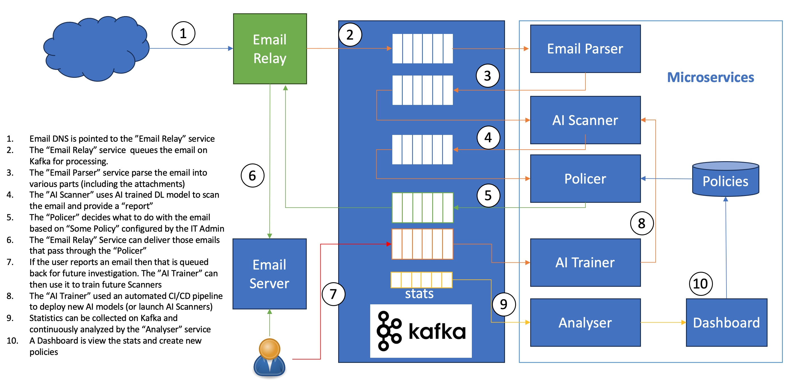

# PhishingForScams System Architecture
PhishingForScams is designed in modules that are intended to scale to support a large volume of emails in a distributed environmnet.

Each module represent a micro-service that can be replicated multiple times. To fully understand the system architecture let's start looking at the basic components first before looking at scaling the system.

## PhishingForScams Component Summary
The following basic components are at the heart of PhishingForScams system:

1. [Queueing Fabric](#queueing-fabric)
2. [Email Relay (proxy) Service](#email-relay-proxy-service)
3. [Email Parser](#email-parser)
4. [AI/ML Scanner](#aiml-scanner)
5. [Email Policer](#email-policer)
4. [Stats Analyzer](#stats-analyzer)
5. [Dashboard](#dashboard)
6. [Database](#database)

## System Overview
The micro-services are inter-connected using the [queueing fabric](#queueing-fabric) and work independently of each other in asynchronous way as shown in the below diagram:

The workflow can be described as follow:
1. Email DNS is pointed to the ”Email Relay” service
2. The “Email Relay” service  queues the email on Kafka for processing.
3. The ”Email Parser” service parse the email into various parts (including the attachments)
4. The ”AI Scanner” uses AI trained DL model to scan the email and provide a “report”
5. The “Policer” decides what to do with the email based on “Some Policy” configured by the IT Admin
6. The “Email Relay” Service can deliver those emails that pass through the “Policer”
7. If the user reports an email then that is queued back for future investigation. The ”AI Trainer” can then use it to train future Scanners
8. The “AI Trainer” used an automated CI/CD pipeline to deploy new AI models (or launch AI Scanners)
9. Statistics can be collected on Kafka and continuously analyzed by the “Analyser” service
10. A Dashboard is view the stats and create new policies

## PhishingForScams Components
### Queueing Fabric
PhishingForScams queueing fabric is a central component that binds everything in the system. The idea is to have each micro-service connect to two queues (or three with statistics) to process it's part. One queue _'the reading queue'_ would be to receive information that need to be processed and the other queue _'the writing queue'_ is to post the results after processing the information (for the next micro-service to pick up and process).

{py:class}`src.q.queue` class provides an abstract definition for a queueing fabric with two methods to implement:

- **read**: to read the incoming work queue
- **write**: to write the completed work to an outgoing queue.

At this time the queueing fabric is implemented using [Kafka](https://github.com/sulphurcrested/kafka) with {py:class}`src.q.kafka_q` which derives {py:class}`src.q.queue`. This modularity makes it easier to switch to another type of queueing fabric in the future if needed.

### Email Relay (proxy) Service
TBA
### Email Parser
TBA
### AI/ML Scanner
TBA
### Email Policer
TBA
### Stats Analyzer
TBA
### Dashboard
TBA
### Database
TBA